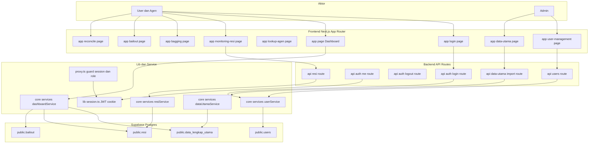
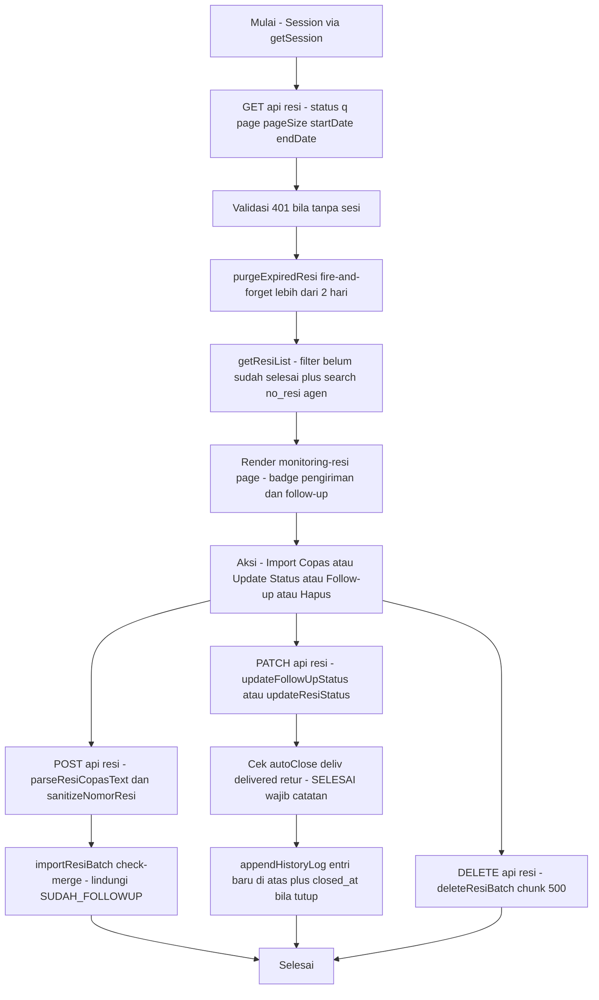
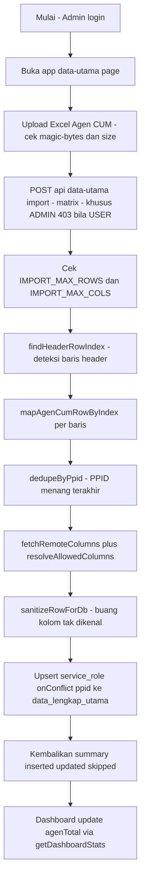
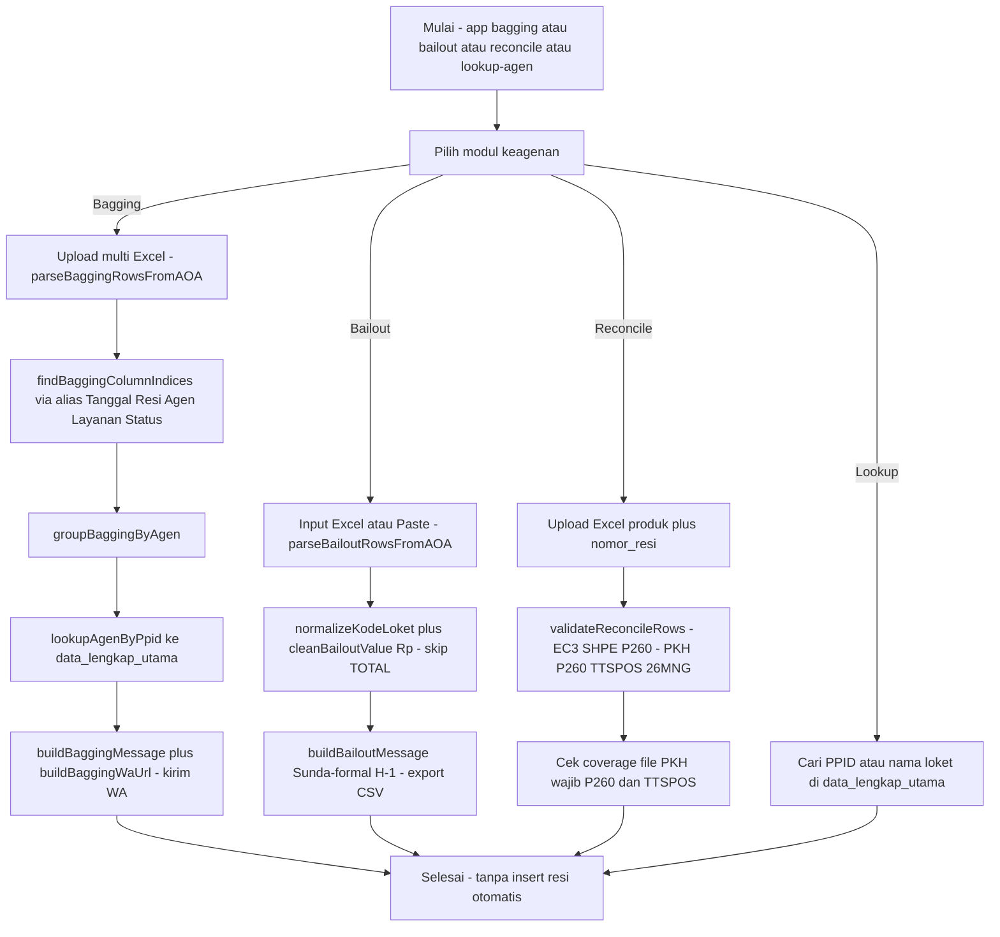
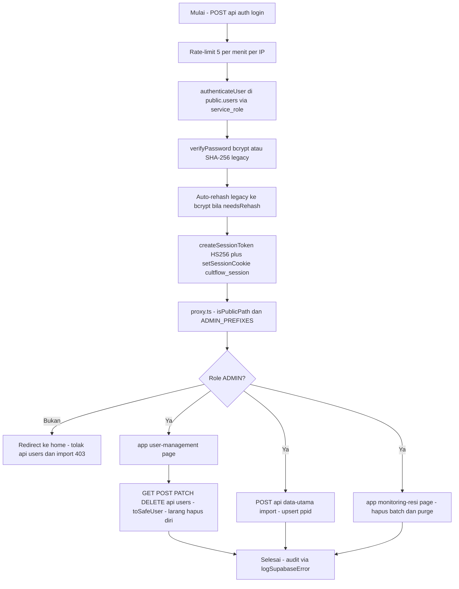

# Dokumentasi Diagram Arsitektur & Flowchart Fitur System (Presisi Base Code)

## DIAGRAM 1: OVERVIEW SELURUH FITUR (DFD LEVEL 1)

---

## DIAGRAM 2: FLOWCHART MODUL RESI (Monitoring dan Follow-Up)

---

## DIAGRAM 3: FLOWCHART MODUL DATA-UTAMA IMPORT

---

## DIAGRAM 4: FLOWCHART MODUL KEAGENAN (Bagging, Bailout, Reconcile & Lookup)

---

## DIAGRAM 5: FLOWCHART MODUL ADMIN BACKOFFICE & AUTH

